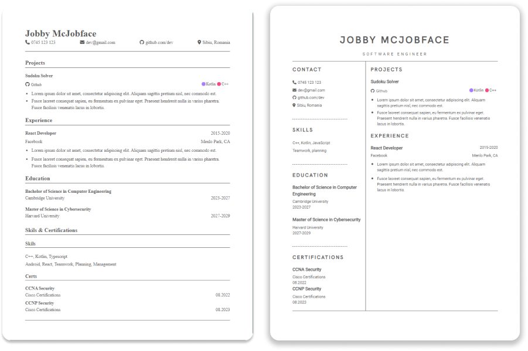

</img>

## About

An open source and simple to use web application to build a professional resume. No account required. Built for devs.

Completely free, no ads. Everything happens on your browser, no server side, your data is completely private. 

### Features

- No account required.
- Multiple templates available.
- Updating the resume in real time.
- Add your coding projects directly from github.
- Local saving. Come back any time and contiune building.

<p align="center">
  </img>
</p>


## Contributing & new templates
Each template is built using a simple component system and style sheet. Everything is located in ```/src/Templates```

- Fork this repository
- Clone the project
- Commit and push changes to your fork
- Submit a Pull Request


