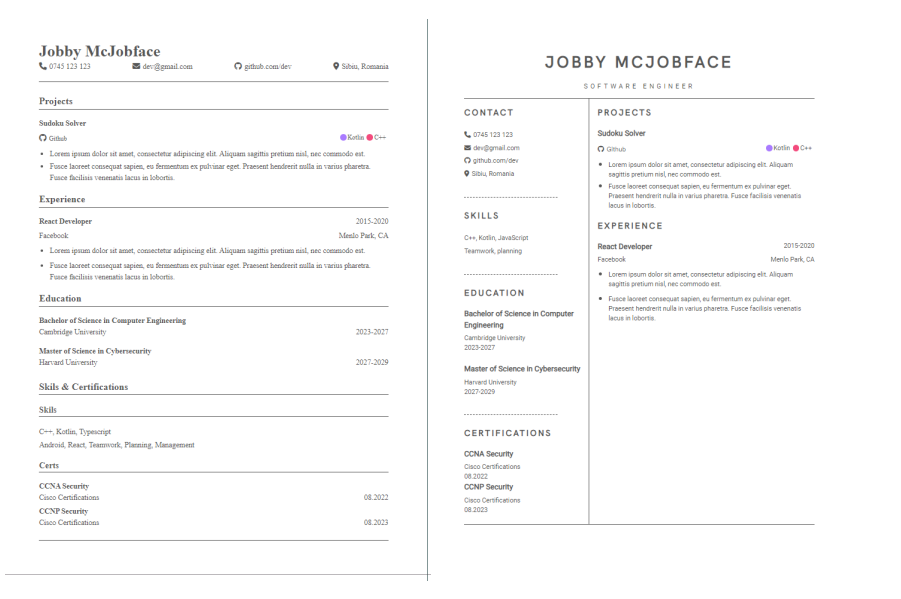

</img>

## About

An open source and simple to use web application to build a professional resume. No account required. Built for devs.

### Features
- No account required.
- Multiple templates available.
- Updating the resume in real time.
- Add your coding projects directly from github.
- Local saving. Come back any time and contiune building.

  </img>

